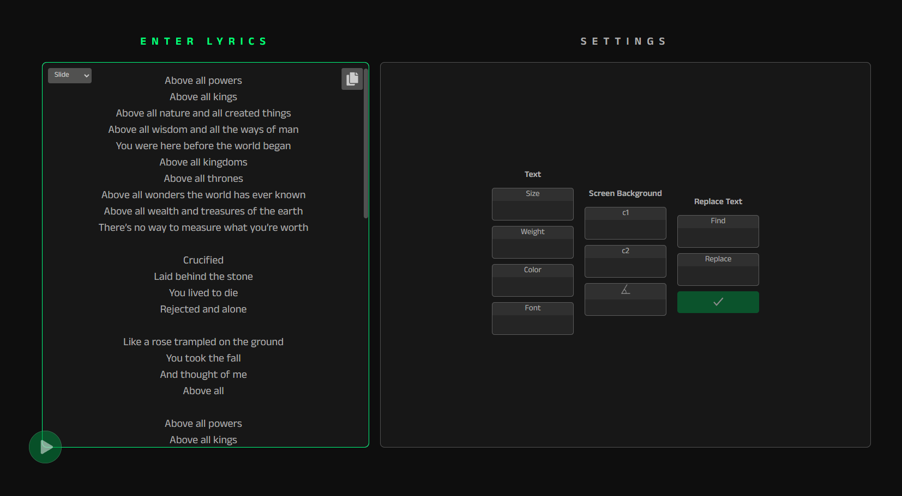
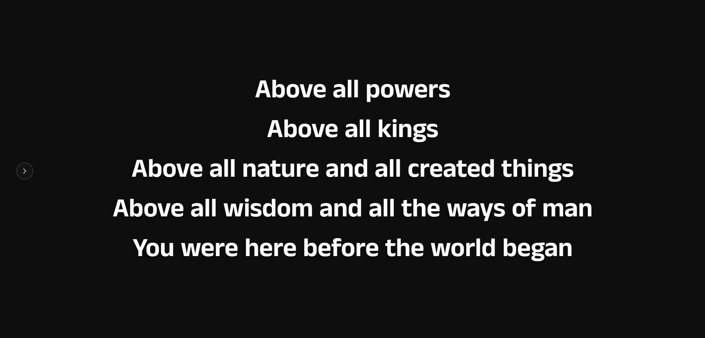

# textToSlidesV3

- **LYRICS TO SLIDES ON THE GO!**
- Apply **Customizations** (Custom Fonts, Colors, Background gradients).
- Consists of two modes **Slides & LowerThird**
- Useful for the **Live Streams** to display the Slides of the Song.
- Seamless **Navigation** between the slides.
- [Explore the site here](https://venu-webdev.github.io/textToSlidesV3)

## Supporting Screenshots

- Add the Lyrics

  

- Slideshow of the lyrics

  

- Customization options

  

- Customized slides

  

- Easy Navigation between the slides

  

- Slide Mode VS Lower Third Mode

  

- Lower Third Mode (Line by line of the lyrics)

  
